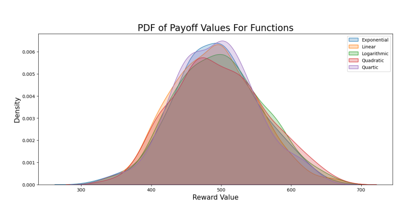
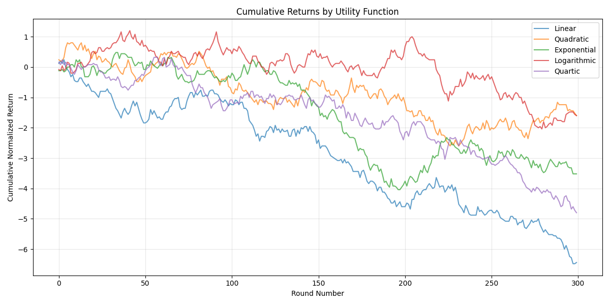
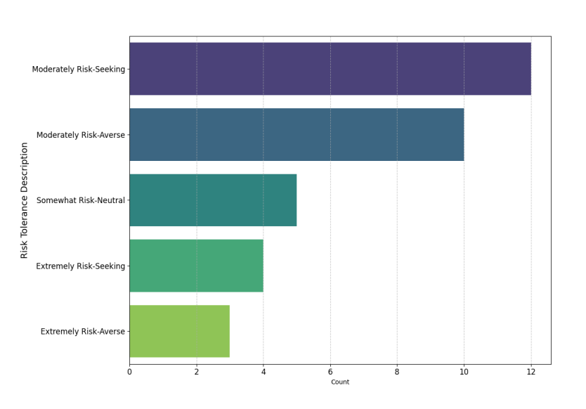
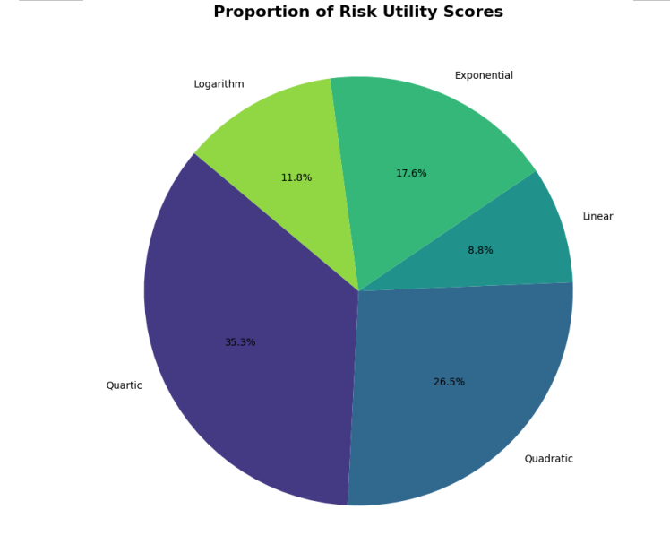

# Quantifying Risk Aversion and Risk-Seeking Behavior Through Utility-Based Policy Learning in Blackjack

This repository contains the implementation and analysis for the research project titled _"Quantifying Risk Aversion and Risk-Seeking Behavior Through Utility-Based Policy Learning in Blackjack"_. The project explores decision-making under risk and uncertainty through utility-based policies in a simulated Blackjack environment.

## Overview

In this research, we modeled Blackjack as a Markov Decision Process (MDP) and applied various utility functions such as Linear, Exponential, Quadratic, Logarithimic, and Quartic - to investigate how different risk preferences influence decision-making. We used dynamic programming techniques to derive optimal policies and analyzed the outcomes using simulations and data analysis.

## Key Features

1. **Blackjack as an MDP**: Models the game as a Markov Decision Process with defined states, actions, and rewards.
2. **Utility-Based Policies**: Implements utility functions to explore risk-averse, risk-neutral, and risk-seeking behaviors.
3. **Simulations**: Evaluates decision-making strategies over multiple rounds using precomputed optimal actions.
4. **Data Analysis**: Provides insights into the impact of different utility functions on gameplay outcomes.

## Results

The simulation study evaluated five utility functions (Linear, Quadratic, Exponential, Logarithmic, and Quartic) over 300 rounds with 15 games per round. Starting with a 500 bankroll and 20 bet size, each simulation used a single deck.

### Key Statistics

| Utility Function | Mean Bankroll | Standard Deviation |
| ---------------- | ------------- | ------------------ |
| Linear           | 489.27        | 60.32              |
| Quadratic        | 497.33        | 64.65              |
| Exponential      | 494.13        | 60.60              |
| Logarithmic      | 497.33        | 62.77              |
| Quartic          | 492.00        | 58.10              |

### Distribution Analysis

The payoff distributions revealed distinct patterns for each utility function. The Quartic function showed the highest volatility with multiple local maxima, while the Linear function demonstrated the lowest probability of high payoffs (>600).

### Cumulative Returns

The Linear utility function exhibited the most stable progression, while the Quartic function showed the largest round-to-round variations. Quadratic and Logarithmic functions displayed significant variability with alternating periods of gains and losses.

### Survey Results

A survey of approximately 35 respondents revealed:

- Most participants self-identified as moderate or neutral risk-takers.
- The Quartic utility function (35.3%) was the most selected risk profile.
- Quadratic (26.5%) and Exponential (17.6%) functions were the next most common choices.
- Linear (8.8%) and Logarithmic (11.8%) functions were less frequently selected.

### Figures

- **Figure 1**: PDF of Payoff Values For Functions  
  
- **Figure 2**: Cumulative Returns by Utility Function  
  
- **Figure 3**: Respondents Self-Evaluation of Risk Tolerance  
  
- **Figure 4**: Respondents' Results (Risk Profile Preferences)  
  

### Citations:

1. [Figure 1: PDF of Payoff Values For Functions](plots/Figure_1.png)
2. [Figure 2: Cumulative Returns by Utility Function](plots/Figure_2.png)
3. [Figure 3: Respondents Self-Evaluation of Risk Tolerance](plots/Figure_3.png)
4. [Figure 4: Respondents' Results](plots/Figure_4.png)

## Contact

For questions or collaborations, feel free to reach out to the authors:

- **Praveen Bandla**  
  Email: [praveen.bandla@nyu.edu](mailto:praveen.bandla@nyu.edu)

- **Tanishq Sardana**  
  Email: [ts5430@nyu.edu](mailto:ts5430@nyu.edu)

- **Dipesh Tharu Mahato**  
  Email: [dm6259@nyu.edu](mailto:dm6259@nyu.edu)
